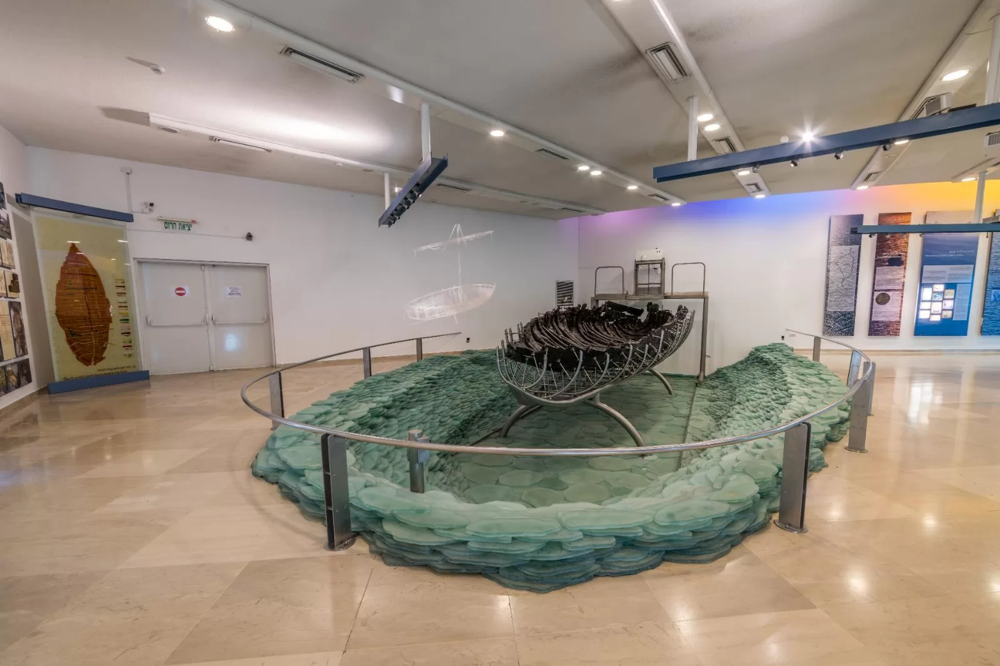

# 🛶 Ginosar Boat AR Experience

An interactive mobile AR application built with Unity and AR Foundation, designed for use in the Yigal Allon Museum to bring the story of the ancient Ginosar Boat to life through image tracking, 3D animation, narration, and educational content.

---

## 📦 Project Source Code

All project source code and assets are stored in **Unity Version Control** (Plastic SCM).  
The repository includes all scenes, scripts, assets, managers, prefabs, UI elements, and configuration files.

🔐 Access to the repository is granted via Unity Cloud DevOps.  
If you are a reviewer or instructor, you have been invited to view the project via the Unity Dashboard.

---

## 📱 Device Requirements

- **Platform:** Android  
- **Minimum OS:** Android 7.0 (Nougat)  
- **Minimum free storage:** 274MB  
- **AR Support:** Device must support [Google ARCore](https://developers.google.com/ar/devices)  
- **Tested on:** Samsung Galaxy S10e

---

## 🚀 Installation Instructions

### ✅ Option: Download and Install APK

1. Download the latest APK build:  
  👉 [Unity Cloud Build - Download APK](https://cloud.unity.com/public-share/build-automation/share?shareId=Wax9gDiWzMBTPxRrJk0XxKv4CH1xo6W7PDsbow1O4nw)
2. Transfer the APK to your Android device.
3. Open and install the app (you may need to enable installation from unknown sources).
4. Allow camera permissions when prompted.

---

## ▶️ How to Use the App

**🌐 Language Selection:**  
At the top of the home screen, choose between **עברית (Hebrew)** or **English**.  
All texts, buttons, and subtitles in the app will adapt based on your selected language.

1. Launch the app – an introductory video and narration will appear.
2. Tap the **Start Experience** button.
3. Point your camera at the **Ginosar Boat marker image** (see below).
4. After recognition:
   - A 3D animated scene appears.
   - Sea audio and narration are played.
5. The main menu appears with 4 interactive buttons:
   - **🧠 Quiz** – Maze game with trivia questions.
   - **🖼 Gallery** – Historical photos of the Ginosar Boat.
   - **🎬 Watch Video** – Link to an external documentary on YouTube.
   - **🚪 Exit** – Exit confirmation dialog.

---

## 📷 Marker Image

Use the following marker to trigger the AR experience:  

You may also print or display this marker on another screen.

---

## 🎥 Demo Video

Watch a short video showcasing the app experience:  
▶️ [Ginosar Boat AR – YouTube Demo](https://youtu.be/pYSJcdPLsd4?si=Fv46IvaKnk7kZ0Gu)

---

## 🗂 Highlights

- ✅ Unity AR Foundation with image tracking
- ✅ Audio narration via Narakeet
- ✅ ProBuilder-based 3D environment
- ✅ Separate canvases for UI, gallery, video, quiz, and game
- ✅ Sound effects for sea, UI, and transitions
- ✅ Manual APK uploaded to Unity Cloud Build

---

## 👥 Team

- **Eden Kantor**
- **Noa Sivan** 

---

## 🔗 Submission Links

- 🔗 Source Code (Unity Version Control – Plastic SCM):  
  Access via Unity DevOps Dashboard (private invite only)
- 🔗 APK Download (Unity Cloud Build):  
  [Download APK](https://cloud.unity.com/public-share/build-automation/share?shareId=Wax9gDiWzMBTPxRrJk0XxKv4CH1xo6W7PDsbow1O4nw)
- 🔗 Demo Video (YouTube):  
  [Watch on YouTube](https://youtu.be/pYSJcdPLsd4?si=Fv46IvaKnk7kZ0Gu)

---

## 🧪 Tested Devices

| Device              | OS Version | ARCore Support | Status     |
|---------------------|------------|----------------|------------|
| Samsung Galaxy S10e | Android 12 | ✅              | ✅ Passed  |

